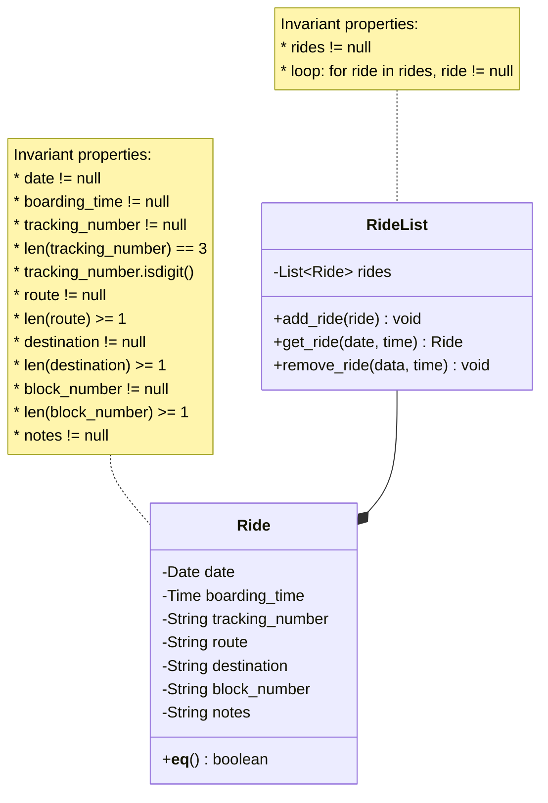

# Bus Tracker

## Domain Model

```mermaid
classDiagram
    class Ride {
        -Date date
        -Time boarding_time
        -String tracking_number
        -String route
        -String destination
        -String block_number
        -String notes
        
        +__eq__() boolean
    }
    
    note for Ride"Invariant properties:
    * date != null
    * boarding_time != null
    * tracking_number != null
    * len(tracking_number) == 3
    * tracking_number.isdigit()
    * route != null
    * len(route) >= 1
    * destination != null
    * len(destination) >= 1
    * block_number != null
    * len(block_number) >= 1
    * notes != null
    "
    
    class RideList {
        -List~Ride~ rides
        
        +add_ride(ride) void
        +get_ride(date, time) Ride
        +remove_ride(data, time) void
    }
    
    RideList --* Ride
    
    note for RideList"Invariant properties:
    * rides != null
    * loop: for ride in rides, ride != null
    "
```

---